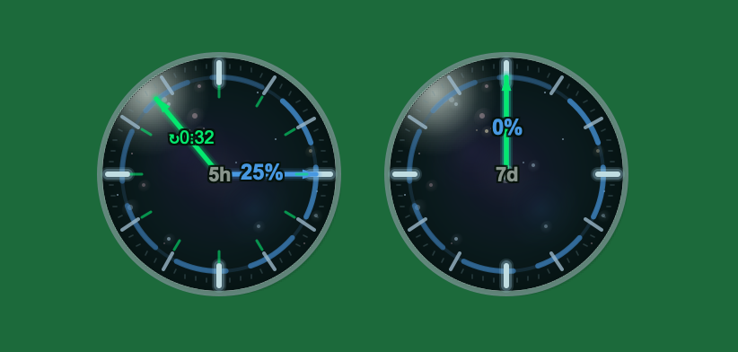

# Floating Ball - Claude Usage Monitor

Desktop widget to help trace Claude subscription usage.
Show your 5-hours and 7-days quota in a floating ball.
Only for Pro/Max subscription (no API trace)



## Installation

### Prerequisites
- macOS 10.14+
- Python 3.9+
- Claude Account

### Quick Setup
clone the projecy.
```bash
./install.sh
./run.sh
```
Or just run 'python3 main.py' after installation.

### Manual Setup
```bash
# Create virtual environment
Desktop widget to help trace Claude subscription usage.python3 -m venv venv
source venv/bin/activate

# Install dependencies
pip install -r requirements.txt

# Install Playwright browser
playwright install chromium

# Run the app
python3 main.py
```
## First Time Setup
1. Launch the app - it will show a gray login icon
2. Right-click the ball and select **Settings...**
3. Click **Login with Claude** - a browser window will open
4. Log in to your Claude account
5. Once logged in, the browser will close automatically
6. Select your organization from the dropdown
7. Click **Save**
```
## License

GPL License - Free to use.

